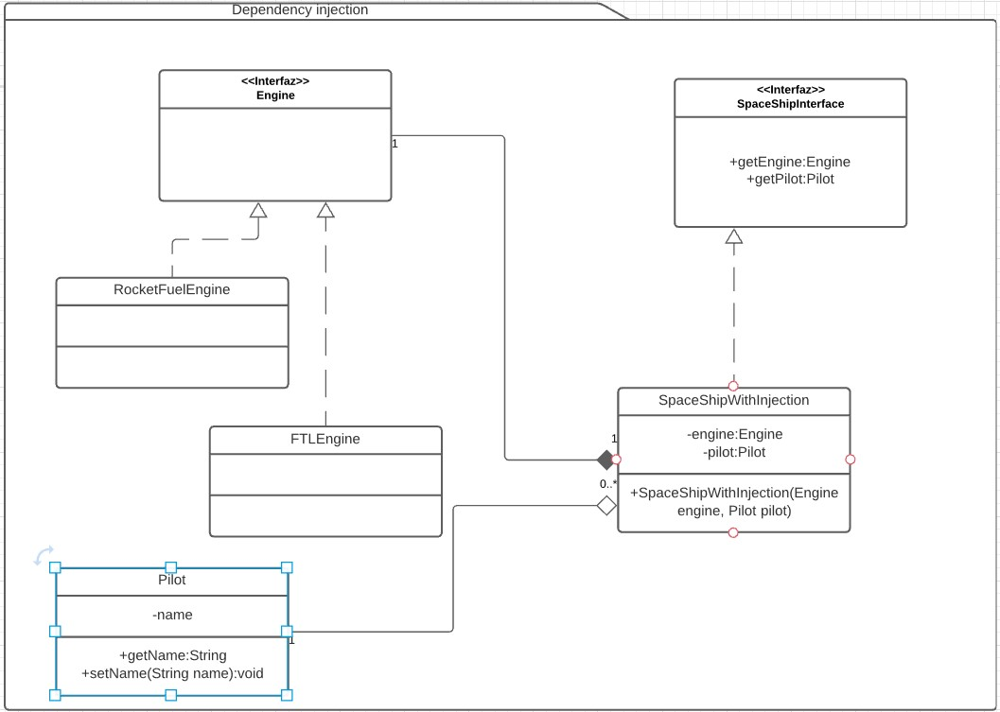

## Dependency Injection
[Link descripcion](https://en.wikipedia.org/wiki/Dependency_injection)

Dependency Injection es la técnica de implementar un objeto sin que instancie sus dependencias, en su lugar este recibe las dependencias en un constructor o mediante métodos setter.

## Diagrama de clases

## SOLID
* Single responsibility

Este patrón no interactua directamente con el principio ya que solo se encarga de que los objetos dependencia sean recibidos por parametro o seteados a través de seters al momento de su creación. Por lo que depende de un buen modelado para cumplir con este principio

* Open/Close principle

Este principio es empoderado con el patron de inyección de dependencias ya que desacopla el objeto quitandole la responsabilidad de saber como instanciar sus dependencias

* Liskov substitution

Otro principio que no afecta directamente al patrón sino al diseño y modelado de la clase en sí. DI solo habla de recibir las dependencias en lugar de instanciarlas

* Interface segregation

Tampoco aplicaría ya que no estamos hablando de las responsabilidades de la clase más alla de la inistanciación de dependencias

* Dependency inversion

Este principio sí aplica ya que lo más seguro es referenciar dependencias mediante una interfaz o clase abstracta y que el "inyector" se encarge de buscar las instancias de clase concreta a referenciar